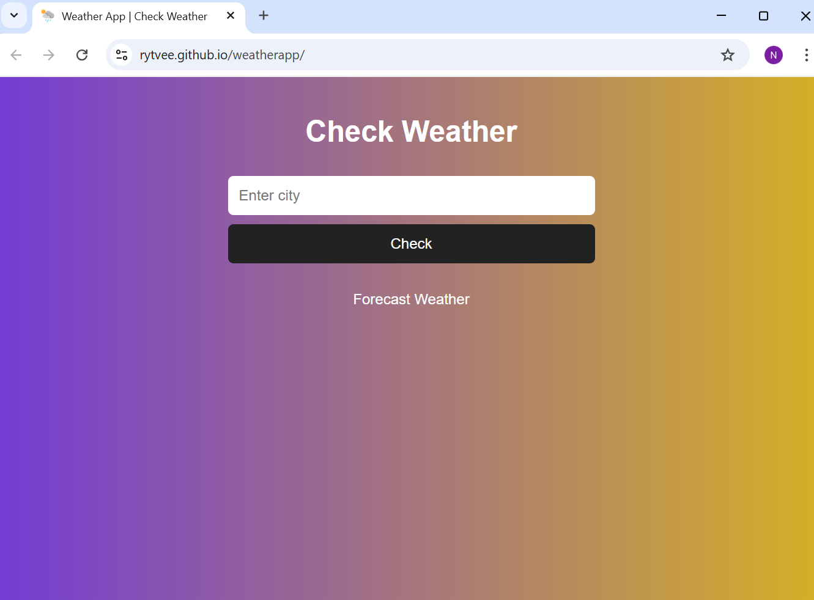
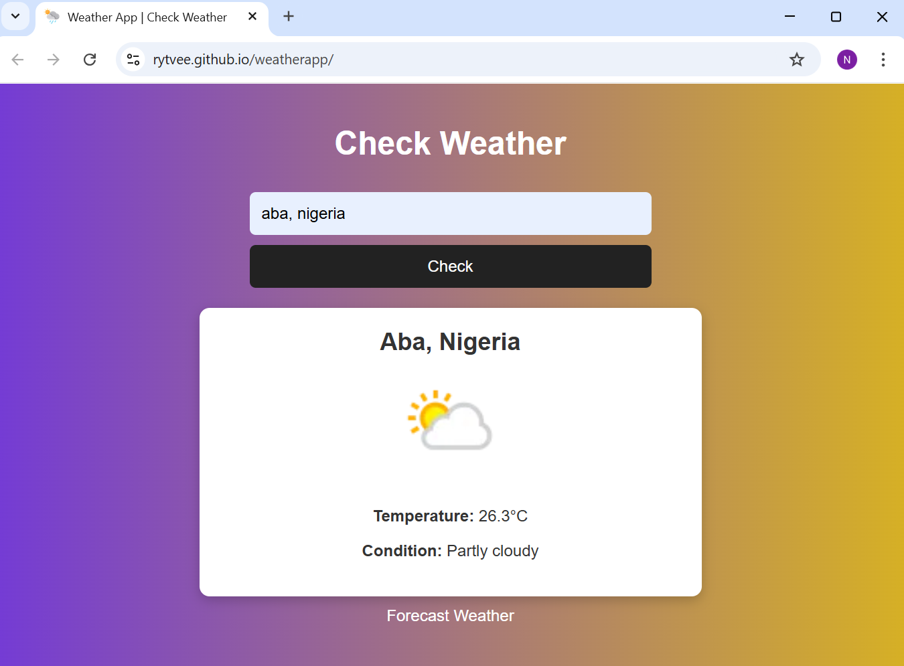
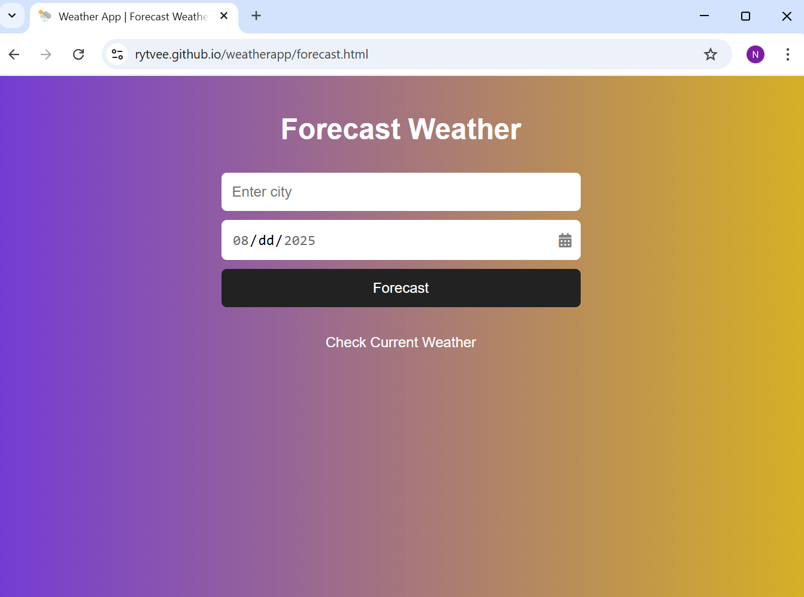
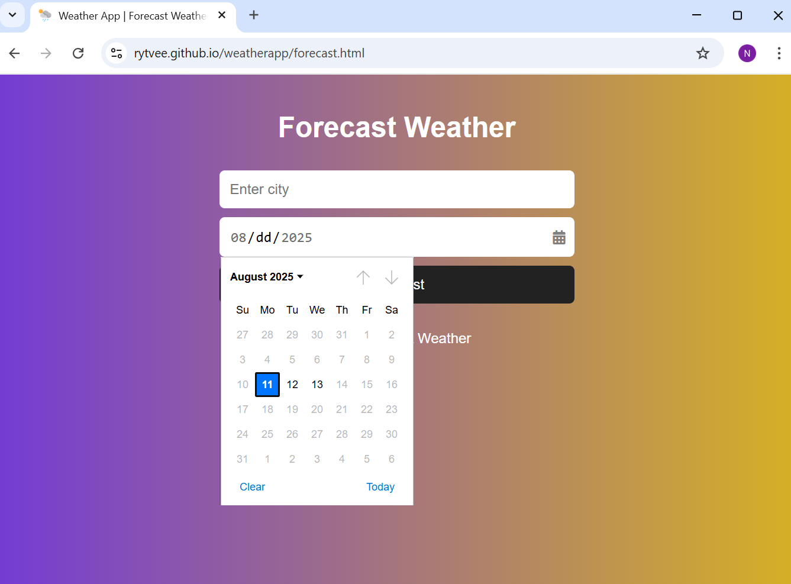
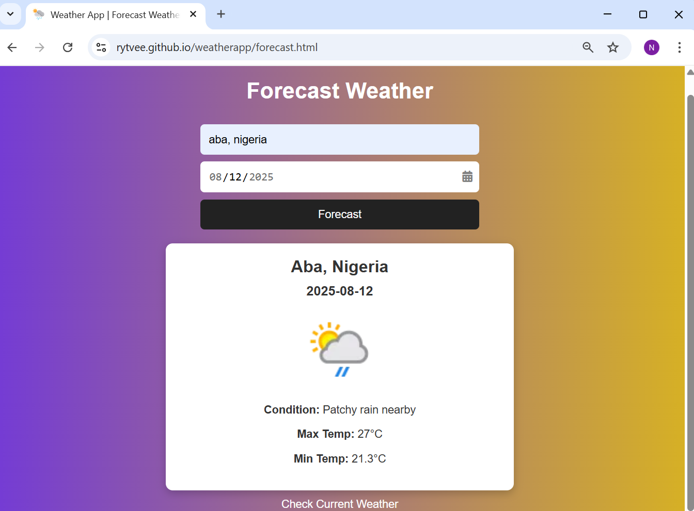

Weather App
A simple JavaScript web application that displays the current weather and a 2-day forecast for any city.
The app fetches real-time weather data using a public weather API and shows details such as temperature, weather condition, humidity, and more.

Live Demo
You can try the app here:
[Live Weather App](https://rytvee.github.io/weatherapp/)

Features
- Search for any city worldwide
- View current weather (temperature, humidity, description)
- See 2-day weather forecast ahead
- Fully responsive design for desktop and mobile
- Built-in date picker for easy date selection

## 🛠 Technologies Used
- HTML5 – Structure of the app
- CSS3 – Styling and responsive layout
- JavaScript (Vanilla JS) – Core logic and API handling
- OpenWeatherMap API – For weather data

## Project Structure
```text
weatherapp/
│── index.html             # Main HTML layout (check current weather)
│── forecast.html          # HTML layout for getting weather forecast
│── style.css              # CSS for styling
│── README.md              # Documentation
│── js/                    # JavaScript logic (API calls, UI interaction)
│ ├── weather.js           # Current weather logic
│ └── forecast.js          # Weather forecast logic
│
└── images/                # Weather icons and images
```

## API handling
This project uses a secured backend layer (Vercel serverless functions) which contains the WeatherAPI serverless endpoint used when the app is deployed to Vercel.
This acts as a proxy between the browser and the external weather API.
The API key is stored securely in Vercel Environment Variables to revents the API key from being exposed in client-side code.

## How It Works
**Browser (GitHub Pages frontend)**  
&nbsp;&nbsp;&nbsp;&nbsp;&nbsp;&nbsp;&nbsp;↓ request to `/api/weather`  
**Vercel Serverless Function** (`weather-api-proxy/`)  
&nbsp;&nbsp;&nbsp;&nbsp;&nbsp;&nbsp;&nbsp;↓ attaches API key from environment  
**External Weather API**  
&nbsp;&nbsp;&nbsp;&nbsp;&nbsp;&nbsp;&nbsp;↑ returns data to Vercel  
**Vercel → Browser**  


## Usage
1. Enter a city name in the search box.
2. Click "Get Weather" or press Enter.
3. View the current weather and 2-day forecast displayed on screen.

## Screenshots

**Check current weather**




**Current weather result**




**Forecast weather**




**Weather forecast date picker**




**Weather forecast result)**




## License
This project is free to use and modify.

